<div align="center">

# 👋 Hi, I'm Prem Kumar Vula

### ☁️ Site Reliability Engineer | AWS | DevOps | Cloud | AIOps

**Building reliable, automated and observable production systems**

<br>

<a href="https://github.com/Premkumarvula">
  
</a>
<a href="https://www.linkedin.com/in/prem-kumar-vula-1105b3197/">
  
</a>

</div>

---

## 🚀 About Me

I'm a **Site Reliability Engineer with 4 years of experience** supporting business-critical production workloads across **AWS and Azure**.

My work focuses on building and maintaining reliable production platforms through:

* ☁️ Cloud infrastructure and production operations
* ☸️ Kubernetes and container troubleshooting
* 🔭 Observability and monitoring
* 🚨 Incident Management & Major Incident Management
* 🔍 Root Cause Analysis and postmortems
* 🏗️ Infrastructure as Code with Terraform
* 🔄 CI/CD automation
* 🐍 Python / Boto3 operational automation
* 🤖 AI-assisted SRE and AIOps

I enjoy solving production problems, automating repetitive operational work, and improving system reliability.

---

## ☁️ Cloud & DevOps Stack

### Cloud Platforms

<p>


</p>

### Containers & Orchestration

<p>


</p>

### Infrastructure as Code

<p>

</p>

### CI/CD

<p>


</p>

---

## 🔭 Observability & SRE

<p>


</p>

### SRE Practices

```text
Incident Management
       ↓
Major Incident Management
       ↓
Root Cause Analysis
       ↓
Postmortems
       ↓
SLI / SLO / SLA
       ↓
Error Budgets
       ↓
MTTR Improvement
       ↓
Continuous Reliability Improvement
```

---

## 🤖 AI / AIOps

One of my current areas of interest is applying **AI to Site Reliability Engineering and production operations**.

### Exploring

* 🤖 Dynatrace Davis AI
* 🧠 AWS Bedrock
* 🔎 LLM / RAG approaches
* 🚨 AI-assisted incident analysis
* 🔍 AI-assisted Root Cause Analysis
* 📊 Anomaly detection
* 📖 Runbook automation
* ⚡ Intelligent operational workflows

My goal is to move from traditional monitoring and alerting toward **AI-assisted and increasingly automated incident response**.

---

## 🐍 Automation

<p>


</p>

I use automation to reduce repetitive operational work, including:

* AWS operational automation
* Log analysis
* Alert handling
* Remediation workflows
* EC2 scheduling
* Snapshot and backup automation
* S3 cleanup
* Linux log rotation
* Production support tooling

---

## 📈 Production Engineering Highlights

<div align="center">

|     Reliability     |           Automation          |       Infrastructure      |
| :-----------------: | :---------------------------: | :-----------------------: |
|      **99.95%**     |            **30%**            |          **70%**          |
| System availability | Reduction in operational toil | Reduction in setup effort |

</div>

---

## 🏗️ Featured Projects

### ☁️ AWS 3-Tier Architecture

Hands-on AWS architecture project covering core components required to build a scalable application environment.

**Focus:**

`VPC` `EC2` `ALB` `Auto Scaling` `RDS` `IAM` `Security Groups`

👉 [View Repository](https://github.com/Premkumarvula/Deploying-3-Tier-Architecture-AWS)

---

### ☸️ Kubernetes Learning

Hands-on Kubernetes learning and experimentation covering workloads, services, configuration, networking and troubleshooting.

**Focus:**

`Pods` `Deployments` `Services` `ConfigMaps` `Secrets` `RBAC` `Networking` `Troubleshooting`

👉 [View Repository](https://github.com/Premkumarvula/Kubernetes_Learning)

---

### 🚀 End-to-End DevOps Deployment

Containerized application deployment with an end-to-end DevOps workflow.

**Focus:**

`Python` `Flask` `Docker` `CI/CD` `Git`

---

### 🤖 AI-Assisted SRE / RAG

Exploring AI-assisted approaches for production incident analysis, troubleshooting and Root Cause Analysis using **AWS Bedrock, LLMs and RAG**.

**Focus:**

`AWS Bedrock` `LLM` `RAG` `Incident Analysis` `RCA` `Runbook Automation`

---

## 🧰 Technologies

```text
Cloud
├── AWS
├── Azure
└── Google Cloud

Containers
├── Kubernetes
├── Amazon EKS
├── GKE
└── Docker

Infrastructure
└── Terraform

CI/CD
├── Jenkins
├── GitHub Actions
└── Git

Observability
├── Dynatrace
├── Davis AI
├── Prometheus
├── Grafana
└── OpenSearch

Automation
├── Python
├── Boto3
├── Bash
└── PowerShell

AI / AIOps
├── AWS Bedrock
├── LLM
├── RAG
├── AI-assisted RCA
└── Runbook Automation
```

---

## 🏆 Certifications

* 🟠 **AWS Certified Solutions Architect – Associate**
* 🔵 **Google Cloud Professional Cloud Architect**
* 🔵 **Google Cloud Associate Cloud Engineer**
* 🟠 **AWS Certified Cloud Practitioner**

---

## 📚 Currently Learning

```text
Advanced AWS Architecture
          ↓
Kubernetes / EKS
          ↓
Terraform & IaC
          ↓
Observability
          ↓
SRE Practices
          ↓
AIOps
          ↓
LLM + RAG
          ↓
AI-Assisted Incident Response
```

---

## 📊 GitHub Statistics

<div align="center">





<br><br>


</div>

---

## 🐍 Contribution Graph

<div align="center">

<picture>
  <source media="(prefers-color-scheme: dark)" srcset="https://raw.githubusercontent.com/Premkumarvula/Premkumarvula/output/github-snake-dark.svg">
  <source media="(prefers-color-scheme: light)" srcset="https://raw.githubusercontent.com/Premkumarvula/Premkumarvula/output/github-snake.svg">
  
</picture>

</div>

---

## 🎯 My Engineering Philosophy

> **Build → Automate → Observe → Troubleshoot → Improve**

I believe reliable systems come from combining strong engineering fundamentals with automation, observability and continuous improvement.

---

<div align="center">

### ☁️ Build Reliable Systems. Automate Everything Possible. 🚀

<br>

⭐ **If you find something useful here, feel free to star the repository!**

</div>
